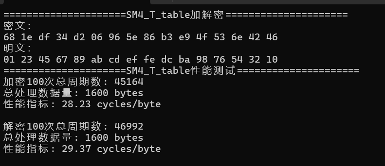
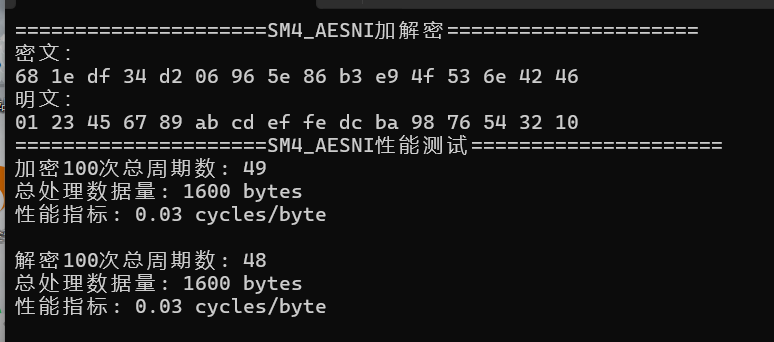
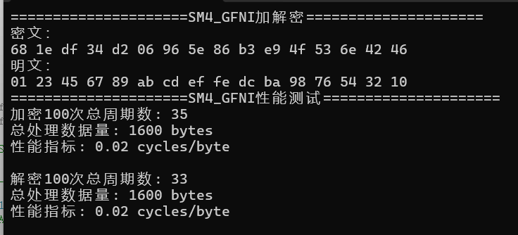

# <center> Project01——SM4的软件实现与优化<center>

<head>
    <script src="https://cdn.mathjax.org/mathjax/latest/MathJax.js?config=TeX-AMS-MML_HTMLorMML" type="text/javascript"></script>
    <script type="text/x-mathjax-config">
        MathJax.Hub.Config({
            tex2jax: {
            skipTags: ['script', 'noscript', 'style', 'textarea', 'pre'],
            inlineMath: [['$','$']]
            }
        });
    </script>
</head>


## 1 实验环境

|    编译器    |               **Visual Studio 2022**                |
| :----------: | :-------------------------------------------------: |
| **操作系统** |                    **Windows11**                    |
|  **处理器**  | **12th Gen intel(R) Core(TM) i5-12500H  (2.50GHz)** |

## 2 SM4算法实现

### 2.1 SM4加解密算法

​		SM4算法采用非平衡Feistel结构，分组长度为128-bit，密钥长度为128-bit，迭代轮数为32轮。本节我们将简述SM4加密算法，重点是展示代码实现。

​		1、输入的128-bit明文$$m$$，按32-bit划分记为$$(X_0^0,X_0^1,X_0^2,X_0^3)$$。

​		2、进行32轮迭代，每一轮有一个32-bit的轮密钥$$K_{i-1}$$参与运算（$$i=1,2,\cdots,32$$）：
$$
\begin{align}
X_i^0&=X_{i-1}^1\\

 X_i^1&=X_{i-1}^2\\

 X_i^2&=X_{i-1}^3\\

 X_i^3&=X_{i-1}^0\oplus T(X_{i-1}^1\oplus X_{i-1}^2\oplus X_{i-1}^3\oplus K_{i-1})
 \end{align}
$$
​		其中，函数$$T:\mathbb{F}_2^{32}\rightarrow\mathbb{F}_2^{32}$$，由非线性变换$$S$$和线性变换$$L$$复合而成。

​		设函数$$T$$的32-bit输入为$$\mathcal{A}=\{a_0,a_1,a_2,a_3\}\in(\mathbb{F}_{2^8})^4$$，则：

- 非线性变换$$S$$：对每个字节单独进行查表代替操作（高4位为行标，低4位为列标），即：

$$
\mathcal{B}=(S(a_0),S(a_1),S(a_2),S(a_3))
$$

- 线性变换$$L$$：对非线性变换$$S$$的32-bit输出$$\mathcal{B}$$，计算（<<<为循环左移）：

$$L(\mathcal{B})=\mathcal{B\oplus(B<<<2)\oplus (B<<<10)\oplus （B<<<18）\oplus (B<<<24)}$$

​		主要实现如下：

```C++
//一轮SM4加密
void SM4_1R(int index, uint32_t* A, uint32_t* rk, bool is_enc, uint32_t temp) {
	uint32_t k = (is_enc == 1 ? rk[index] : rk[31 - index]);
	temp = A[1] ^ A[2] ^ A[3] ^ k;
	temp = (Sbox[temp >> 24] << 24) | (Sbox[(temp >> 16) & 0xff] << 16) | (Sbox[(temp >> 8) & 0xff] << 8) | (Sbox[temp & 0xff]);
	temp = A[0] ^ temp ^ rotl32(temp, 2) ^ rotl32(temp, 10) ^ rotl32(temp, 18) ^ rotl32(temp, 24);
	A[0] = A[1];
	A[1] = A[2];
	A[2] = A[3];
	A[3] = temp;
}

void SM4(uint8_t* input, uint8_t* output, uint32_t* rk, bool is_enc) {
	uint32_t A[4];
	uint32_t temp = 0;
	A[0] = ((uint32_t)input[0] << 24) | ((uint32_t)input[1] << 16) | ((uint32_t)input[2] << 8) | input[3];
	A[1] = ((uint32_t)input[4] << 24) | ((uint32_t)input[5] << 16) | ((uint32_t)input[6] << 8) | input[7];
	A[2] = ((uint32_t)input[8] << 24) | ((uint32_t)input[9] << 16) | ((uint32_t)input[10] << 8) | input[11];
	A[3] = ((uint32_t)input[12] << 24) | ((uint32_t)input[13] << 16) | ((uint32_t)input[14] << 8) | input[15];
	for (int i = 0; i < 32; i++) {
		SM4_1R(i, A, rk, is_enc, temp);
	}
	uint32_t tmp = A[0];
	A[0] = A[3];
	A[3] = tmp;
	tmp = A[1];
	A[1] = A[2];
	A[2] = tmp;

	output[0] = (A[0] >> 24) & 0xFF; output[1] = (A[0] >> 16) & 0xFF;
	output[2] = (A[0] >> 8) & 0xFF; output[3] = A[0] & 0xFF;
	output[4] = (A[1] >> 24) & 0xFF; output[5] = (A[1] >> 16) & 0xFF;
	output[6] = (A[1] >> 8) & 0xFF; output[7] = A[1] & 0xFF;
	output[8] = (A[2] >> 24) & 0xFF; output[9] = (A[2] >> 16) & 0xFF;
	output[10] = (A[2] >> 8) & 0xFF; output[11] = A[2] & 0xFF;
	output[12] = (A[3] >> 24) & 0xFF; output[13] = (A[3] >> 16) & 0xFF;
	output[14] = (A[3] >> 8) & 0xFF; output[15] = A[3] & 0xFF;
}
```

### 2.2 轮密钥生成

​		SM4算法的主密钥$$k$$为128-bit，轮密钥生成方案采用非平衡Feistel结构。本小节我们将简述其轮密钥生成方案，重点展示代码的实现。

​		 1、将$$k$$按32-bit进行划分，记为$$(MK_0,MK_1,MK_2,MK_3)$$。然后，分别与32-bit的系统参数$$FK_0,FK_1,FK_2,FK_3$$进行异或。记为：
$$
\begin{align}
 K_{-4}&=MK_0\oplus FK_0\\

 K_{-3}&=MK_1\oplus FK_1\\

 K_{-2}&=MK_2\oplus FK_2\\

 K_{-1}&=MK_3\oplus FK_3
\end{align}
$$
​		2、生成轮密钥$$K_i(i=0,1,\cdots,31)$$：
$$
K_i=K_{i-4}\oplus T'(K_{i-3}\oplus K_{i-2}\oplus K_{i-1}\oplus CK_i)
$$
​		其中函数$$T'$$只需将加密算法中的函数$$T$$中的线性变换$$L$$替换为：
$$
L'(\mathcal{B})=\mathcal{B\oplus (B<<<13)\oplus(B<<<23)}
$$
​		主要代码实现：

```C++
//初始密钥
#define LOAD_KEY(index)\
	do{\
		k[index]=(key[index<<2]<<24)|(key[(index<<2)+1]<<16)|(key[(index<<2)+2]<<8)|(key[(index<<2)+3]);\
		k[index]=k[index]^FK[index];\
	}while(0)

//一轮轮密钥生成
#define KEY_GEN_1R(index)\
	do{\
		temp=k[1]^k[2]^k[3]^CK[index];\
		temp=(Sbox[temp>>24]<<24)|(Sbox[(temp>>16)&0xff]<<16)|(Sbox[(temp>>8)&0xff]<<8)|(Sbox[temp&0xff]);		\
		rk[index]=k[0]^temp^rotl32(temp,13)^rotl32(temp,23);\
		k[0]=k[1];\
		k[1]=k[2];\
		k[2]=k[3];\
		k[3]=rk[index];\
	}while(0)

void SM4_KEY_GEN(uint8_t* key, uint32_t* rk) {
	uint32_t k[4];
	uint32_t temp;
	LOAD_KEY(0);
	LOAD_KEY(1);
	LOAD_KEY(2);
	LOAD_KEY(3);
	for (int i = 0; i < 32; i++) {
		KEY_GEN_1R(i);
	}
}
```

## 3 SM4 T-table优化

​		S盒操作为$$x_0,x_1,x_2,x_3\rightarrow S(x_0),S(x_1),S(x_2),S(x)_3$$，其中$x_0,x_1,x_2,x_3$为8bit。为了提高效率，可以将S盒与后续的线性变换$$L$$合并，得到：
$$
L(S(x_0),S(x_1),S(x_2),S(x_3))\\

=L(S(x_0)<<24)\oplus L(S(x_1)<<16)\oplus L(S(x_2)<<8)\oplus L(S(x_3))
$$
​		定义4个8bit$\rightarrow$32bit查找表$T_i$：
$$
\begin{aligned}
T_0(x)&=L(S(x_0)<<24)\\
T_1(x)&=L(S(x_1)<<16)\\
T_2(x)&=L(S(x_2)<<8)\\
T_3(x)&=L(S(x_3))\\
\end{aligned}
$$
​		SM4一轮加解密实现如下：

```C++
//一轮SM4加密
void SM4_T_table_1R(int index, uint32_t* A, uint32_t* rk, bool is_enc, uint32_t temp) {
	uint32_t k = (is_enc == 1 ? rk[index] : rk[31 - index]);
	temp = A[1] ^ A[2] ^ A[3] ^ k;
    temp = A[0] ^ Table0[(temp >> 24) & 0xff] ^ Table1[(temp >> 16) & 0xff] ^ Table2[(temp >> 8) & 0xff] ^ Table3[temp & 0xff];
	A[0] = A[1];
	A[1] = A[2];
	A[2] = A[3];
	A[3] = temp;
}
```

## 4 SM4 AESNI优化

​		主要使用SIMD和域同构的方法对SM4进行优化。基本思想是利用SM4与AES中S盒结构的相似性，借助intel的AESNI指令完成S盒操作。由于SM4的S盒与AES的S盒所属的数域都是$$GF(2^8)$$，由近世代数的知识可知，二者之间存在一个同构映射。

​		找到同构映射后，在SM4进入S盒前，将SM4的S盒输入值映射到AES的数域，然后通过_mm_aesenclast_si128()完成S盒的操作得到输出，再将输出逆映射回SM4的数域即可。


​		这里注意，SM4和AES的存储方式不同（分别为小端序和大端序），因此在进行映射前先转换存储方式。且为了消除AES最后一轮行移位与异或密钥的影响，这里使用逆行移位与异或0密钥来处理。具体实现如下(其中矩阵乘法采用了查找表的方式实现，具体[参考](https://www.cnblogs.com/kentle/p/15826075.html))：

```C++
#define OPT_SM4_1R(index)\
	do{\
	__m128i k=_mm_set1_epi32((is_enc==1?rk[index]:rk[31-index]));\
	temp=xor4(A[1],A[2],A[3],k);\
    temp=SM4_SBOX(temp);\
    temp=xor6(A[0],temp,rotl_epi32(temp,2),rotl_epi32(temp,10),rotl_epi32(temp,18),rotl_epi32(temp,24));\
    A[0]=A[1];\
    A[1]=A[2];\
    A[2]=A[3];\
    A[3]=temp;\
	}while(0)

#define MulMatrix(x,highmask,lowmask)\
(_mm_xor_si128(_mm_shuffle_epi8(lowmask,_mm_and_si128(x,_mm_set1_epi32(0x0f0f0f0f))),\
				_mm_shuffle_epi8(highmask,_mm_and_si128(_mm_srli_epi16(x,4),_mm_set1_epi32(0x0f0f0f0f)))))

//进行同构映射
__m128i SM4_INPUT_TO_AES(__m128i x) {
	__m128i highmask = _mm_set_epi8(0x22, 0x58, 0x1a, 0x60, 0x02, 0x78, 0x3a, 0x40, 0x62, 0x18,
		0x5a, 0x20, 0x42, 0x38, 0x7a, 0x00);
	__m128i lowmask = _mm_set_epi8(0xe2, 0x28, 0x95, 0x5f, 0x69, 0xa3, 0x1e, 0xd4, 0x36, 0xfc,
		0x41, 0x8b, 0xbd, 0x77, 0xca, 0x00);
	return MulMatrix(x, highmask, lowmask);
}

__m128i AES_OUTPUT_TO_SM4(__m128i x) {
	__m128i highmask = _mm_set_epi8(0x14, 0x07, 0xc6, 0xd5, 0x6c, 0x7f, 0xbe, 0xad, 0xb9, 0xaa,
		0x6b, 0x78, 0xc1, 0xd2, 0x13, 0x00);
	__m128i lowmask = _mm_set_epi8(0xd8, 0xb8, 0xfa, 0x9a, 0xc5, 0xa5, 0xe7, 0x87, 0x5f, 0x3f,
		0x7d, 0x1d, 0x42, 0x22, 0x60, 0x00);
	return MulMatrix(x, highmask, lowmask);
}

__m128i SM4_SBOX(__m128i x) {
	__m128i mask = _mm_set_epi8(0x03, 0x06, 0x09, 0x0c, 0x0f, 0x02, 0x05, 0x08,
		0x0b, 0x0e, 0x01, 0x04, 0x07, 0x0a, 0x0d, 0x00);
	//逆行移位和全零密钥抵消AES最后一轮操作，只保留过S盒
	x = _mm_shuffle_epi8(x, mask);
	x = _mm_xor_si128(SM4_INPUT_TO_AES(x), _mm_set1_epi8(0b00100011));
	x = _mm_aesenclast_si128(x, _mm_setzero_si128());
	return _mm_xor_si128(AES_OUTPUT_TO_SM4(x), _mm_set1_epi8(0b00111011));
}

void SM4_AESNI(uint8_t* input, uint8_t* output, uint32_t* rk, bool is_enc) {
	__m128i temp;
	__m128i A[4];
	__m128i vindex;
	temp = _mm_loadu_si128((__m128i*)input);
	vindex = _mm_setr_epi8(3, 2, 1, 0, 7, 6, 5, 4, 11, 10, 9, 8, 15, 14, 13, 12);
	//小端序-->大端序
	A[0] = _mm_unpacklo_epi64(_mm_unpacklo_epi32(temp, temp), _mm_unpacklo_epi32(temp, temp));
	A[1] = _mm_unpackhi_epi64(_mm_unpacklo_epi32(temp, temp), _mm_unpacklo_epi32(temp, temp));
	A[2] = _mm_unpacklo_epi64(_mm_unpackhi_epi32(temp, temp), _mm_unpackhi_epi32(temp, temp));
	A[3] = _mm_unpackhi_epi64(_mm_unpackhi_epi32(temp, temp), _mm_unpackhi_epi32(temp, temp));
	A[0] = _mm_shuffle_epi8(A[0], vindex);
	A[1] = _mm_shuffle_epi8(A[1], vindex);
	A[2] = _mm_shuffle_epi8(A[2], vindex);
	A[3] = _mm_shuffle_epi8(A[3], vindex);
	for (int i = 0; i < 32; i++) {
		OPT_SM4_1R(i);
	}
	//大端序-->小端序
	A[0] = _mm_shuffle_epi8(A[0], vindex);
	A[1] = _mm_shuffle_epi8(A[1], vindex);
	A[2] = _mm_shuffle_epi8(A[2], vindex);
	A[3] = _mm_shuffle_epi8(A[3], vindex);
	_mm_storeu_si128((__m128i*)output, _mm_unpacklo_epi64(_mm_unpacklo_epi32(A[3], A[2]), _mm_unpacklo_epi32(A[1], A[0])));

}
```

## 5 SM4 GFNI优化

​		可以使用gf2p8affineqb指令直接计算$GF(2^8)$上的同构映射，比AESNI使用的指令数更少。这里映射矩阵与常数向量[参考](https://www.cnblogs.com/kentle/p/15826075.html)。具体实现如下：

```c++
// SM4 S盒到AES S盒的仿射变换矩阵

__m128i sm4_to_aes_matrix = _mm_set1_epi64x(0b00000110'00010111'00001010'00110101'00111010'01110010'10011011'00001101);
// AES S盒到SM4 S盒的仿射变换矩阵

__m128i aes_to_sm4_matrix = _mm_set1_epi64x(0b10011100'00111010'10001100'11000100'01110100'11000011'01100001'10101000);

// 仿射变换常数
__m128i sm4_to_aes_constant = _mm_set1_epi8(0b00100011);
__m128i aes_to_sm4_constant = _mm_set1_epi8(0b00111011);

// 使用GF2P8AFFINEQB和AES-NI实现的SM4 S盒
__m128i SM4_BOX_TO_AES_GFNI(__m128i x) {
	
	// 1. SM4输入 -> AES输入
	__m128i aes_input = _mm_gf2p8affine_epi64_epi8(x, sm4_to_aes_matrix, 0);

	aes_input = _mm_xor_si128(aes_input, sm4_to_aes_constant);

	// 2. 使用AES-NI计算AES S盒
	// 这里使用AESENCLAST指令，因为AES S盒 = AESENCLAST(x, 0)
	__m128i aes_output = _mm_aesenclast_si128(aes_input, _mm_setzero_si128());

	// 3. AES输出 -> SM4输出
	__m128i sm4_output = _mm_gf2p8affine_epi64_epi8(aes_output, aes_to_sm4_matrix, 0);
	sm4_output = _mm_xor_si128(sm4_output, aes_to_sm4_constant);

	return sm4_output;
}

#define GFNI_SM4_1R(index)\
	do{\
	__m128i k=_mm_set1_epi32((is_enc==1?rk[index]:rk[31-index]));\
	temp=xor4(A[1],A[2],A[3],k);\
    temp=SM4_BOX_TO_AES_GFNI(temp);\
    temp=xor6(A[0],temp,rotl_epi32(temp,2),rotl_epi32(temp,10),rotl_epi32(temp,18),rotl_epi32(temp,24));\
    A[0]=A[1];\
    A[1]=A[2];\
    A[2]=A[3];\
    A[3]=temp;\
	}while(0)
```


## 4 结果展示

* 正确性：

​		输入明文和密钥均为：

```C++
uint8_t input[16] = { 0x01, 0x23, 0x45, 0x67, 0x89, 0xab, 0xcd, 0xef, 0xfe, 0xdc, 0xba, 0x98, 0x76, 0x54, 0x32, 0x10 };
uint8_t key[16] = { 0x01, 0x23, 0x45, 0x67, 0x89, 0xab, 0xcd, 0xef, 0xfe, 0xdc, 0xba, 0x98, 0x76, 0x54, 0x32, 0x10 };

```

​		通过在线加密平台得到密文：


​		下述实现均参考该结果来判断正确性。

* 结果分析

​		使用每个字节需要的时钟周期数作为性能指标。

​	**原始：**


**T-table优化：**



**AESNI优化：**



**GFNI优化：**



​		由上可以看到，所有的优化结果均正确，且最终优化了近2000倍！
