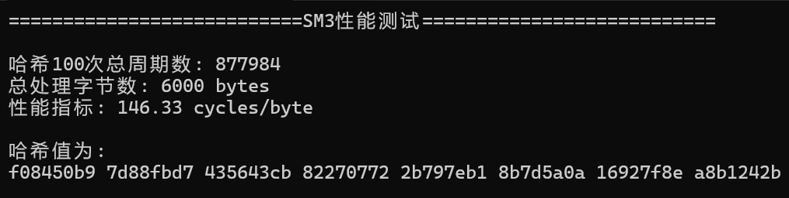

# <center>Project04——SM3的软件实现与优化<center>

## 1 SM3软件实现

### 1.1 实验环境

|    编译器    |                    **Visual Studio 2022**                    |
| :----------: | :----------------------------------------------------------: |
| **操作系统** |                        **Windows11**                         |
|  **处理器**  | **AMD Ryzen 7 5800H with Radeon Graphics          (3.20 GHz)** |
| **机带RAM**  |                          **16 GB**                           |

### 1.2 SM3算法实现

由于SM3需要对消息进行分组处理，因此我们定义SM3消息结构体，用于当前组的哈希处理：

```C++
typedef struct sm3_ctx {
    //存储当前摘要值
    uint32_t digest[digest_size / sizeof(uint32_t)];
    //已经处理的块数
    int num_block;
    //缓冲
    uint8_t buffer[block_size];
    //buffer中未处理的字节数
    int num;
}SM3_CTX;

```

#### 1.2.1 消息填充

SM3需要将输入消息按512bit进行分组，因此分组前要先将输入消息填充为512的倍数长度。假设消息$m$的长度为$l$比特，则首先将"1"添加到消息的末尾，再添加$k$个“0”，$k$是满足$l+1+k\equiv 448\ (mod\ 512)$的最小非负整数，然后再添加一个64比特串，该比特串是$l$的二进制表示。

由于实现时我们是对消息一块一块进行处理而不是先填充，因此需要单独处理消息的最后一块（也就是填充）。由于是按字节处理，因此先判断剩余的最后一块按规则填充后需要占用几块。若是一块则直接处理，若是两块则需要处理完当前块再继续处理下一块。具体实现如下：

```C++
void SM3_FINAL(SM3_CTX* ctx, uint8_t* digest) {
    uint32_t* p = (uint32_t*)digest;
    uint64_t* len = (uint64_t*)(ctx->buffer + block_size - 8);

    //消息末尾添加1和若干0
    ctx->buffer[ctx->num] = 0x80;

    //若剩余空间能够添加9字节(0x80+8字节消息长度)
    if (ctx->num + 9 <= block_size) {
        memset(ctx->buffer + ctx->num + 1, 0, block_size - ctx->num - 9);
    }
    else {
        //填充为整块处理
        memset(ctx->buffer + ctx->num + 1, 0, block_size - ctx->num - 1);
        CF(ctx->digest, ctx->buffer);
        memset(ctx->buffer, 0, block_size - 8);
    }
    //填充消息长度
    len[0] =(uint64_t)(ctx->num_block) * 512 + (ctx->num << 3);
    len[0] = to_BE64(len[0]);
    CF(ctx->digest, ctx->buffer);
    for (uint32_t i = 0; i < 8; i++){
        p[i] =to_BE32(ctx->digest[i]);
    }
    memset(ctx, 0, sizeof(SM3_CTX));
}
```

#### 1.2.2 消息扩展

将填充后的消息$m'$按512比特进行分组：$m'=B^{(0)}B^{(1)}\cdots B^{(n-1)}$，$n=(l+k+65)/512$，按照以下方法扩展生成132个消息字$W_0,W_1,\cdots,W_{67},W'_0,W'_1,\cdots,W'_{63}$：


​		具体实现如下：

```c++
    //消息扩展
    uint32_t W[68], W1[64];
    const uint32_t* p = (const uint32_t*)(block);
    //每个字转换为大端存储
    for (int i = 0; i < 16; i++) {
        W[i] = to_BE32( p[i]);
    }
    for (int i = 16; i < 68; i++) {
        W[i] = P1(W[i - 16] ^ W[i - 9] ^ rotl32(W[i - 3], 15)) ^ rotl32(W[i - 13], 7) ^ W[i - 6];
    }
    for (int i = 0; i < 64; i++) {
        W1[i] = W[i] ^ W[i + 4];
    }
```


#### 1.2.3 压缩函数

压缩函数算法如下图所示：


具体实现如下：

```C++

    //压缩
    uint32_t SS1, SS2, TT1, TT2;

    for (int i = 0; i < 16; i++) {
        SS1 = rotl32((rotl32(A, 12) + E + rotl32(T0, i)), 7);
        SS2 = SS1 ^ rotl32(A, 12);
        TT1 = FF0(A, B, C) + D + SS2 + W1[i];
        TT2 = GG0(E, F, G) + H + SS1 + W[i];
        D = C,C = rotl32(B, 9), B = A,A = TT1;
        H = G, G = rotl32(F, 19), F = E, E = P0(TT2);
    }
    for (int i = 16; i < 64; i++) {
        SS1 = rotl32((rotl32(A, 12) + E + rotl32(T1, i)), 7);
        SS2 = SS1 ^ rotl32(A, 12);
        TT1 = FF1(A, B, C) + D + SS2 + W1[i];
        TT2 = GG1(E, F, G) + H + SS1 + W[i];
        D = C, C = rotl32(B, 9),B = A,A = TT1;
        H = G, G = rotl32(F, 19), F = E, E = P0(TT2);
    }

    digest[0] ^= A, digest[1] ^= B, digest[2] ^= C, digest[3] ^= D;
    digest[4] ^= E, digest[5] ^= F, digest[6] ^= G, digest[7] ^= H;

```

#### 1.2.4 迭代压缩

综上实现迭代压缩过程。根据定义的结构体，我们当前处理SM3分组消息ctx，若之前有没填满的块，则先尝试补齐。然后对消息进行分块处理，直到剩余消息不足一块。

```C++
void SM3_UPDATE(SM3_CTX* ctx, const uint8_t* data, size_t dlen) {
    //处理之前未填满的块
    if (ctx->num) {
        unsigned int n = block_size - ctx->num;
        //新数据不足以填充为整块
        if (dlen < n) {
            //放到buffer中等待处理
            memcpy(ctx->buffer + ctx->num, data, dlen);
            ctx->num += dlen;
            return;
        }
        else {
            //填充为整块进行处理
            memcpy(ctx->buffer + ctx->num, data, n);
            CF(ctx->digest, ctx->buffer);
            ctx->num_block++;
            data += n;
            dlen -= n;
        }
    }
    while (dlen >= block_size) {
        CF(ctx->digest, data);
        ctx->num_block++;
        data += block_size;
        dlen -= block_size;
    }
    ctx->num = dlen;
    if (dlen) {
        memcpy(ctx->buffer, data, dlen);
    }
}
```

最后对消息进行填充。也就是处理最后一个块时，按填充规则进行填充。若一个块可以容纳所有填充内容，则直接处理该块；否则需要两个块进行容纳填充内容，然后依次处理两个块即可。

```C++
void SM3_FINAL(SM3_CTX* ctx, uint8_t* digest) {
    uint32_t* p = (uint32_t*)digest;
    uint64_t* len = (uint64_t*)(ctx->buffer + block_size - 8);

    //消息末尾添加1和若干0
    ctx->buffer[ctx->num] = 0x80;

    //若剩余空间能够添加9字节(0x80+8字节消息长度)
    if (ctx->num + 9 <= block_size) {
        memset(ctx->buffer + ctx->num + 1, 0, block_size - ctx->num - 9);
    }
    else {
        //填充为整块处理
        memset(ctx->buffer + ctx->num + 1, 0, block_size - ctx->num - 1);
        CF(ctx->digest, ctx->buffer);
        memset(ctx->buffer, 0, block_size - 8);
    }
    //填充消息长度
    len[0] =(uint64_t)(ctx->num_block) * 512 + (ctx->num << 3);
    len[0] = to_BE64(len[0]);
    CF(ctx->digest, ctx->buffer);
    for (uint32_t i = 0; i < 8; i++){
        p[i] =to_BE32(ctx->digest[i]);
    }
    memset(ctx, 0, sizeof(SM3_CTX));
}
```

## 2 SM3优化实现

### 2.1 SIMD优化

​		这里主要使用SIMD的方法对SM3进行优化。其中主要提高消息扩展的并行性，一次生成四个字。

```C++
//SIMD生成W[68]，每次生成128bit，也就是W[4*j]，W[4*j+1]，W[4*j+2]，W[4*j+3]
void GEN_W(int j, uint32_t * W) {
    W[4 * j] = P1(W[4 * j - 16] ^ W[4 * j - 9] ^ (rotl32(W[4 * j - 3], 15))) ^ rotl32(W[4 * j - 13], 7) ^ W[4 * j - 6];
    __m128i W_j_16 = _mm_setr_epi32(W[4 * j - 16], W[4 * j - 15], W[4 * j - 14], W[4 * j - 13]);
    __m128i W_j_9 = _mm_setr_epi32(W[4 * j - 9], W[4 * j - 8], W[4 * j - 7], W[4 * j - 6]);
    __m128i W_j_3 = _mm_setr_epi32(W[4 * j - 3], W[4 * j - 2], W[4 * j - 1], W[4 * j]);
    __m128i W_j_13 = _mm_setr_epi32(W[4 * j - 13], W[4 * j - 12], W[4 * j - 11], W[4 * j - 10]);
    __m128i W_j_6 = _mm_setr_epi32(W[4 * j - 6], W[4 * j - 5], W[4 * j - 4], W[4 * j - 3]);
      __m128i re = xor3(
        SIMD_P1(xor3(W_j_16, W_j_9, SIMD_rotl32(W_j_3, 15))),
        SIMD_rotl32(W_j_13, 7),
        W_j_6
    );
    _mm_storeu_si128((__m128i*) & W[4 * j], re);
}
//同理生成W1[64]
void GEN_W1(int j, uint32_t* W1, uint32_t* W) {
    _mm_storeu_si128((__m128i*) & W1[4*j], _mm_xor_si128(_mm_loadu_si128((__m128i*) & W[4*j]), _mm_loadu_si128((__m128i*) & W[4 * j + 4])));
    
}
```

### 2.2 openssl优化

​		此处我们使用openssl提供的接口实现SM3。openssl中，有关SM3的实现是套用了Hash函数的模板，即MD结构的函数，使用宏函数来减少函数调用，且SM3充分利用函数流水的方式来减少中间变量。

```C++
void SM3_openssl(const std::string& input) {
    // 初始化 OpenSSL
    OpenSSL_add_all_algorithms();
    ERR_load_crypto_strings();
    // 创建消息摘要上下文
    EVP_MD_CTX* mdctx = EVP_MD_CTX_new();
    const EVP_MD* md = EVP_sm3();
    // 初始化 SM3 哈希计算
    EVP_DigestInit_ex(mdctx, md, NULL);
    // 更新哈希计算（输入数据）
    EVP_DigestUpdate(mdctx, input.c_str(), input.length());
    // 存储哈希结果的缓冲区
    unsigned char hash[EVP_MAX_MD_SIZE];
    unsigned int hashLen = 0;
    EVP_DigestFinal_ex(mdctx, hash, &hashLen);
    // 完成哈希计算
    EVP_DigestFinal_ex(mdctx, hash, &hashLen);
    // 释放上下文
    EVP_MD_CTX_free(mdctx);
    // 清理 OpenSSL 资源
    EVP_cleanup();
    ERR_free_strings();
}
```

## 3 SM3优化结果

### 3.1 正确性

使用在线平台对消息`SDUSDUSDUSDUSDUSDUSDUSDUSDUSDUSDUSDUSDUSDUSDUSDUSDUSDUSDUSDU`进行SM3哈希得到：


在下面的展示中，哈希结果均与该值相同。

### 3.2 性能

**原始SM3：**



**SIMD优化：**


性能提升了约3.7倍。

**openssl优化：**


性能提升了约7.7倍。

## 4 SM3的长度扩展攻击

长度扩展攻击是针对MD结构的哈希函数的攻击手段。其大致思路为：若已知某填充后的消息$M=M_1||M_2$的哈希值$H(M)$，则可以知道对于任意消息$M'$，$H(M||M')$的值。

攻击方法只需将初始IV替换为$H(M)$，然后将$M'$与替换后的IV输入哈希函数即可。注意$M'$填充的消息长度应该是$M||M'$的长度。此时$H'(M')=H(M||M')$

具体实现如下：

定义附加消息填充函数，其需满足最后64比特的长度为附加消息长度和填充后的原始消息长度之和。这里填充后的原始消息长度为1块（可以是任意块，此题以1块为例子）。

```C++
uint32_t PADDING_attack(uint8_t* m, size_t len, uint8_t* buffer) {
    uint32_t bit_len = 8 * len;
    //原消息是1块
    len = len - 64;
    uint32_t left_bit = bit_len % 512;
    int k = left_bit > 448 ? 2 : 1;
    //填充后的字节数
    uint32_t after_padding_len = (len / 64) * 64 + k * 64;
    int i;
    __m128i* p = (__m128i*)m;
    __m128i* q = (__m128i*)buffer;
    for (i = 0; i < len / 16; i++) {
        _mm_storeu_si128(q + i, _mm_loadu_si128(p + i));
    }
    memcpy(buffer + (len / 16) * 16, m + (len / 16) * 16, len % 16);
    buffer[len] = 0x80;
    //填充0
    memset(&buffer[len + 1], 0, after_padding_len - (len + 1) - 8);
    //填充长度
    uint64_t bit_len_be = ((bit_len & 0xFF00000000000000ull) >> 56) |
        ((bit_len & 0x00FF000000000000ull) >> 40) |
        ((bit_len & 0x0000FF0000000000ull) >> 24) |
        ((bit_len & 0x000000FF00000000ull) >> 8) |
        ((bit_len & 0x00000000FF000000ull) << 8) |
        ((bit_len & 0x0000000000FF0000ull) << 24) |
        ((bit_len & 0x000000000000FF00ull) << 40) |
        ((bit_len & 0x00000000000000FFull) << 56);
    memcpy(&buffer[after_padding_len - 8], &bit_len_be, 8);
    return after_padding_len;
}
```

定义原始消息填充后拼接附加消息的函数，用于验证哈希值。

```C++
uint32_t PADDING_AND_APPEND(uint8_t* m, size_t len, uint8_t* buffer, uint8_t* append, size_t append_len) {
    PADDING(m, len, buffer);
    memcpy(buffer + PADDING(m, len, buffer), append, append_len);
    //append后消息的总字节数
    return PADDING(m, len, buffer) + append_len;
}
```

定义自定义输入IV的SM3哈希算法：

```C++
void SIMD_SM3_attack(uint8_t* m, uint32_t* hash, size_t len, uint8_t* buffer,uint32_t * IV1) {
    uint32_t n = PADDING_attack(m, len, buffer) / 64;
    for (int i = 0; i < n; i++) {
        SIMD_CF(IV1, buffer + i * 64);
    }
    for (int i = 0; i < 8; i++) {
        hash[i] =IV1[i];
    }
}
```

综上我们可以进行伪造。初始消息为abc，得到填充后的哈希值h。附加消息为abc，我们可以在不知道填充后的消息abc||PADDING的情况下直接计算消息abc||PADDING||abc的哈希值。H(abc||PADDING||abc)=H'(abc)，其中H‘是输入IV为h的哈希函数。

最终结果如下：


可以看到伪造成功。即长度扩展攻击下的哈希值与原消息填充后级联上附加消息的哈希值相同。

## 5 Merkle-Tree

Merkle-Tree的结构为：父节点的值是两个子节点的哈希值级联后的哈希值。一个例子如下图所示：


一个叶子的认证路径是从该叶子计算到根节点所需要的节点的集合。如上图中$a_{000}$的认证路径为$\{ a_{001},a_{01},a_{1}\}$。

我们将上述哈希函数换成SM3，构造哈希函数，并构建叶子的存在性证明和不存在性证明。

### 5.1 构建Merkle-Tree

使用python实现Merkle-Tree。设叶子节点作为序列进行输入。我们由下而上构建Merkle-Tree，只需将当前层的节点两两级联计算哈希值作为上一层的节点，直到构建到根节点即可。

```python
    def build_tree(self, leaves: List[bytes]) -> List[List[bytes]]:
        """构建Merkle树"""
        if not leaves:
            return []
        # 哈希所有叶子节点
        tree = [[rfc6962_hash_leaf(leaf) for leaf in leaves]]
        # 逐层构建树
        current_level = tree[0]
        while len(current_level) > 1:
            next_level = []
            # 处理成对的节点
            for i in range(0, len(current_level), 2):
                left = current_level[i]
                right = current_level[i + 1] if i + 1 < len(current_level) else left
                next_level.append(rfc6962_hash_node(left, right))
            tree.append(next_level)
            current_level = next_level
        return tree
```

### 5.2 认证路径

对于某一个叶子节点，添加其兄弟节点到认证路径；然后更新该叶子节点为其父节点，添加其父节点的兄弟节点到认证路径......按照上述操作不断生成认证路径，直到该节点更新为根节点。

```python
    def get_proof(self, index: int) -> List[bytes]:
        """获取存在性证明的路径"""
        if index < 0 or index >= len(self.leaves):
            raise IndexError("Leaf index out of range")
        proof = []
        for level in self.tree[:-1]:
            # 添加兄弟节点到证明路径
            if index % 2 == 1:
                proof.append(level[index - 1])
            else:
                if index + 1 < len(level):
                    proof.append(level[index + 1])
                else:
                    # 如果是奇数个节点且是最后一个，不需要添加
                    pass
            # 向上移动到父节点
            index = index // 2
        return proof
```

### 5.3 (不)存在性证明

**构建叶子节点的存在性证明：**

只需生成该叶子节点的认证路径，然后根据认证路径计算根节点哈希值，若其与原树的根节点值相等，则证明叶子节点存在。

```python
    def verify_proof(self, leaf: bytes, proof: List[bytes], index: int) -> bool:
        """验证存在性证明"""
        current_hash = rfc6962_hash_leaf(leaf)
        for i, sibling in enumerate(proof):
            if index % 2 == 0:
                # 当前节点是左节点
                current_hash = rfc6962_hash_node(current_hash, sibling)
            else:
                # 当前节点是右节点
                current_hash = rfc6962_hash_node(sibling, current_hash)
            index = index // 2
        return current_hash == self.root
```

**构建叶子节点的不存在性证明：**

将所有叶子节点进行排序，然后查找该不存在叶子应插入的位置，从而得到其两个邻居(边界情况下是一个邻居)，然后生成其邻居的存在性证明即可。

```python
    def get_non_inclusion_proof(self, leaf: bytes):
        """获取不存在性证明"""
        # 检查叶子是否已存在
        if leaf in self.leaves:
            return self.leaves.index(leaf),None, None
        # 获取排序后的（叶子值, 原始索引）列表
        sorted_leaves = sorted((leaf_val, idx) for idx, leaf_val in enumerate(self.leaves))
        leaf_values = [item[0] for item in sorted_leaves]
        original_indices = [item[1] for item in sorted_leaves]
        # 使用二分查找定位插入位置
        insert_pos = bisect.bisect_left(leaf_values, leaf)
        # 处理三种情况
        if insert_pos == 0:
            # 情况1：比所有叶子都小 -> 只需证明最小叶子存在
            neighbor = leaf_values[0]
            proof = self.get_proof(original_indices[0])
            return insert_pos,None, proof

        elif insert_pos == len(leaf_values):
            # 情况2：比所有叶子都大 -> 只需证明最大叶子存在
            neighbor = leaf_values[-1]
            proof = self.get_proof(original_indices[-1])
            return insert_pos,None, proof

        else:
            # 情况3：在两个叶子之间 -> 需证明左右叶子连续
            left_neighbor = leaf_values[insert_pos - 1]
            right_neighbor = leaf_values[insert_pos]
            left_proof = self.get_proof(original_indices[insert_pos - 1])
            right_proof = self.get_proof(original_indices[insert_pos])
            return (self.leaves.index(left_neighbor),self.leaves.index(right_neighbor),),(left_neighbor, right_neighbor), (left_proof, right_proof)
```

### 5.4 测试结果

对于存在节点，验证其认证路径是否合法。对于不存在的节点，验证其邻居节点的认证路径是否合法。

```python
def test(leaf,leaves,merkle_tree):
    """测试节点是否存在"""
    idx,neighbors,non_inclusion_proof=merkle_tree.get_non_inclusion_proof(leaf)
    # 不存在证明为空，说明存在
    if non_inclusion_proof is None:
        print(f"该节点存在。")
    else:
        if neighbors is None:
            print(f"该节点只有一个邻居：{leaves[idx]}")
            is_valid = merkle_tree.verify_proof(leaves[idx], merkle_tree.get_proof(idx), idx)
            if is_valid:
                print(f"该节点邻居存在，说明该节点不存在。")
            else:
                print(f"该节点不存在证明生成失败。")

        else:
            left_idx,right_idx=idx
            left_neighbor, right_neighbor = neighbors
            left_proof, right_proof = non_inclusion_proof
            print(f"该节点的左右邻居为：{left_neighbor}，{right_neighbor}")
            left_is_valid = merkle_tree.verify_proof(left_neighbor, left_proof, left_idx)
            right_is_valid = merkle_tree.verify_proof(right_neighbor, right_proof, right_idx)
            if left_is_valid and right_is_valid:
                print(f"该节点左右邻居均存在，说明该节点不存在。")
            else:
                print(f"该节点不存在证明生成失败。")
```

结果如下：

