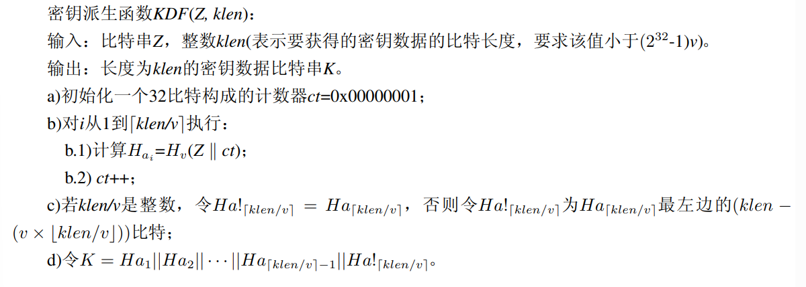
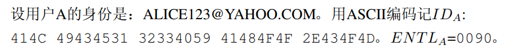
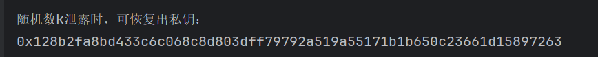
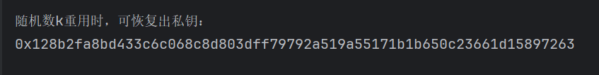
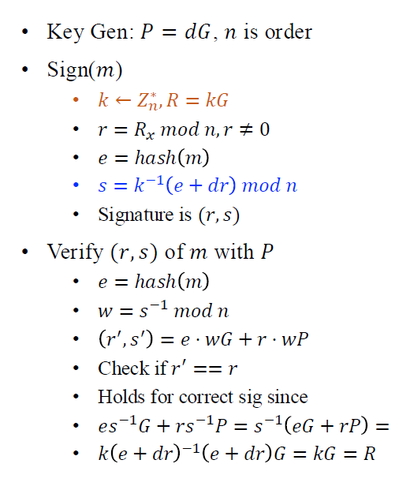

# <center>Project05——SM2的软件实现与优化<center>

## 1 实验环境

|     IDE      |               PyCharm Community Edition 2024.1               |
| :----------: | :----------------------------------------------------------: |
| **操作系统** |                        **Windows11**                         |
|  **处理器**  | **AMD Ryzen 7 5800H with Radeon Graphics          (3.20 GHz)** |
| **机带RAM**  |                          **16 GB**                           |

## 2 SM2软件实现

本项目使用python基于国家密码管理局发布的[《SM2椭圆曲线公钥密码算法》]([国家密码管理局关于发布《SM2椭圆曲线公钥密码算法》公告（国密局公告第21号）_国家密码管理局](https://oscca.gov.cn/sca/xxgk/2010-12/17/content_1002386.shtml))实现SM2公钥加密算法。所选参数如下图：


下面给出SM2相关部分的python实现。

### 2.1 密钥派生函数(KDF)

设密码杂凑函数为$H_v()$，其输出是长度为$v$比特的杂凑值。这里使用SM3杂凑算法。

KDF定义如下所示：



```python
# 密钥派生函数KDF。接收的参数是比特串Z和要获得的密钥数据的长度klen。返回klen长度的密钥数据比特串K
def KDF(Z, klen):
    v = 256          
    if klen >= (pow(2, 32) - 1) * v:
        raise Exception("密钥派生函数KDF出错，请检查klen的大小！")
    ct = 0x00000001
    if klen % v == 0:
        l = klen // v
    else:
        l = klen // v + 1
    Ha = []
    for i in range(l):
        # s存储 Z || ct 的比特串形式 # 注意，ct要填充为32位
        s = Z + int_to_bits(ct).rjust(32, '0')         
        s_bytes = bits_to_bytes(s)        
        s_list = [i for i in s_bytes]
        hash_hex = sm3.sm3_hash(s_list)
        hash_bin = hex_to_bits(hash_hex)
        Ha.append(hash_bin)
        ct += 1
    if klen % v != 0:
        Ha[-1] = Ha[-1][:klen - v*(klen//v)]
    k = ''.join(Ha)
    return k
```

### 2.2 数据类型转换

SM2算法中涉及很多数据类型的转换，如下图所示：


* **整数到字节串的转换**

输入：非负整数$x$，以及字节串的目标长度$k$(其中$k$满足$2^{8k}>x$)。

输出：长度为$k$的字节串$M$。

具体转换过程：设$M_{k-1},M_{k-2},\cdots,M_0$是$M$从最左边到最右边的字节，则满足$x=\sum_{i=0}^{k-1}2^{8i}M_i$。即将$x$填充为$8k$位，再每8位合成一字节。

```python
def int_to_bytes(x, k):
    if pow(256, k) <= x:
        raise Exception("无法实现整数到字节串的转换，目标字节串长度过短！")
    # s是k*2位十六进制串
    s = hex(x)[2:].rjust(k*2, '0')
    M = b''
    for i in range(k):
        M = M + bytes([eval('0x' + s[i*2:i*2+2])])
    return M
```

* **字节串到整数的转换**

输入：长度为$k$的字节串$M$。

输出：整数$x$。

是上述转换的逆，只需将每个字节转成比特串即可。

```python
def bytes_to_int(M):           
    k = len(M)          
    x = 0           
    for i in range(k-1, -1, -1):
        x += pow(256, k-1-i) * M[i]
    return x
```

* **比特串与字节串的相互转换**

本质上与字节串与整数的转换相同。

```python
def bits_to_bytes(s):
    k = ceil(len(s)/8)
    s = s.rjust(k*8, '0')
    M = b''
    for i in range(k):
        M = M + bytes([eval('0b' + s[i*8: i*8+8])])
    return M

def bytes_to_bits(M):          
    s_list = []
    for i in M:
        s_list.append(bin(i)[2:].rjust(8, '0'))         
    s = ''.join(s_list)
    return s

```

* **域元素到字节串的转换**

输入：$\alpha\in\mathbb{F}_q$。

输出：长为$l=\lceil\frac{t}{8}\rceil$的字节串$S$，其中$t=\lceil\log_2 q\rceil$。

若$q$为奇素数，则$\alpha\in[0,q-1]$，即将整数$\alpha$转换为长为$l$的字节串即可。

若$q=2^m$，则$\alpha$为长为$m$的比特串，将比特串$\alpha$转换为长度为$l$的字节串即可。

本项目选择参数为素数，因此只考虑第一种情况。

```python
def fielde_to_bytes(e):
    q = eval('0x' + '8542D69E 4C044F18 E8B92435 BF6FF7DE 45728391 5C45517D 722EDB8B 08F1DFC3'.replace(' ', ''))
    t = ceil(log(q, 2))
    l = ceil(t / 8)
    return int_to_bytes(e, l)
```

* **字节串到域元素的转换**

即域转换为字节串中第一种情况的逆。

```python
def bytes_to_fielde(M):         
    return bytes_to_int(M)
```

* **域元素到整数的转换**

由于$q$为奇素数，因此不需要转换。

```python
def fielde_to_int(a):
    return a
```

* **点到字节串的转换**

输入：椭圆曲线上的点$P=(x_p,y_p)$，$P\neq\mathcal{O}$。

输出：字节串$S$。采用未压缩表示形式，字节串长度为$2l+1$。

将域元素$y_p(x_p)$转换为长度为$l$的字节串$Y_1(X_1)$，令$PC=04$，返回字节串$S=PC||X_1||Y_1$。

```python
def point_to_bytes(P):
    xp, yp = P[0], P[1]
    x = fielde_to_bytes(xp)
    y = fielde_to_bytes(yp)
    PC = bytes([0x04])
    s = PC + x + y
    return s
```

* **字节串到点的转换**

输入：长为$2l+1$的字节串$S$。

输出：椭圆曲线上的点$P=(x_p,y_p)\neq\mathcal{O}$。

先检查$PC$是否等于$04$，再将$X_1,Y_1$转换为域中的元素即可。

```python
def bytes_to_point(s):
    if len(s) % 2 == 0:
        raise Exception("无法实现字节串到点的转换，请检查字节串是否为未压缩形式！")
    l = (len(s) - 1) // 2
    PC = s[0]
    if PC != 4:
        raise Exception("无法实现字节串到点的转换，请检查PC是否为b'04'！")
    x = s[1: l+1]
    y = s[l+1: 2*l+1]
    xp = bytes_to_fielde(x)
    yp = bytes_to_fielde(y)
    P = (xp, yp)            
    return P
```

### 2.3 $\mathbb{F}_p$上的椭圆曲线运算

* $\mathcal{O}+\mathcal{O}=\mathcal{O}$；
* $\forall P=(x,y)\in E(\mathbb{F}_p) \textbackslash {\mathcal{O}},P+\mathcal{O}=\mathcal{O}+P=P$；
* $\forall P=(x,y)\in E(\mathbb{F}_p)\textbackslash\mathcal{O},-P=(x,-y),P+(-P)=\mathcal{O}$；
* 两个非互逆的不同点相加的规则：

设$P_1=(x_1,y_1),P_2=(x_2,y_2)$，均不为$\mathcal{O}$且$x_1\neq x_2$。则$P_3=(x_3,y_3)=P_1+P_2$：

$x_3=\lambda^2-x_1-x_2,y_3=\lambda(x_1-x_3)-y_1$，其中$\lambda=\frac{y_2-y_1}{x_2-x_1}$。

```python
def frac_to_int(up, down, p):
    num = gcd(up, down)
    up //= num
    down //= num         # 分子分母约分
    return up * calc_inverse(down, p) % p

def add_point(P, Q, p):
    if P == 0:
        return Q
    if Q == 0:
        return P
    x1, y1, x2, y2 = P[0], P[1], Q[0], Q[1]
    e = frac_to_int(y2 - y1, x2 - x1, p)            
    x3 = (e*e - x1 - x2) % p           
    y3 = (e * (x1 - x3) - y1) % p
    ans = (x3, y3)
    return ans

```

* 倍点规则：

设$P_1=(x_1,y_1)\ne\mathcal{O}$，且$y_1\ne 0$，$P_3=(x_3,y_3)=P_1+P_1$，则：

$x_3=\lambda^2-2x_1,y_3=\lambda(x_1-x_3)-y_1$，其中$\lambda=\frac{3x_1^2+a}{2y_1}$。

```python
def double_point(P, p, a):
    if P == 0:
        return P
    x1, y1 = P[0], P[1]
    e = frac_to_int(3 * x1 * x1 + a, 2 * y1, p)        
    x3 = (e * e - 2 * x1) % p         
    y3 = (e * (x1 - x3) - y1) % p
    Q = (x3, y3)
    return Q
```

* 多倍点运算：

$Q=[k]P=[k-1]P+P$，可递归求得。

```python
def mult_point(P, k, p,a):
    if k == 1:
        return P
    result = P
    for _ in range(k - 1):
        if result==P:
            result=double_point(P,p,a)
        else:
            result = add_point(result, P, p)
    return result
```


### 2.4 SM2加密算法

设需要发送的消息为比特串$M$，$Klen$为$M$的比特长度，公钥为$P_B$。执行以下运算步骤对$M$进行加密：

$A_1$：用随机数发生器产生随机数$k\in[1,n-1]$；

$A_2$：计算椭圆曲线点$C_1=[k]G=(x_1,y_1)$，将$C_1$转换为比特串；

$A_3$：计算椭圆曲线点$S=[h]P_B$，若$S=\mathcal{O}$，报错；

$A_4$：计算椭圆曲线点$[k]P_B=(x_2,y_2)$，并将$x_2,y_2$转换为比特串；

$A_5$：计算$t=KDF(x_2||y_2,klen)$，若$t=0$，则返回$A_1$；

$A_6$：计算$C_2=M\oplus t$；

$A_7$：计算$C_3=Hash(x_2||M||y_2)$；

$A_8$：输出密文$C=C_1||C_2||C_3$。

```python
def encry_sm2(args, PB, M):
    p, a, b, h, G, n = args
    M_bytes = bytes(M, encoding='ascii')
    k = random.randint(1, n-1)
    k_hex = hex(k)[2:]
    C1 = mult_point(G, k, p, a)
    C1_bits = point_to_bits(C1)
    S = mult_point(PB, h, p, a)
    if S == 0:
        raise Exception("计算得到的S是无穷远点")
    x2, y2 = mult_point(PB, k, p, a)
    x2_bits = fielde_to_bits(x2)
    y2_bits = fielde_to_bits(y2)
    M_hex = bytes_to_hex(M_bytes)
    klen = 4 * len(M_hex)
    t = KDF(x2_bits + y2_bits, klen)
    if eval('0b' + t) == 0:
        raise Exception("KDF返回了全零串，请检查KDF算法！")
    t_hex = bits_to_hex(t)
    C2 = eval('0x' + M_hex + '^' + '0b' + t)
    x2_bytes = bits_to_bytes(x2_bits)
    y2_bytes = bits_to_bytes(y2_bits)
    hash_list = [i for i in x2_bytes + M_bytes + y2_bytes]
    C3 = sm3.sm3_hash(hash_list)
    C1_hex = bits_to_hex(C1_bits)
    C2_hex = hex(C2)[2:]
    C3_hex = C3
    C_hex = C1_hex + C2_hex + C3_hex
    print("加密得到的密文是：", C_hex)
    return C_hex
```


### 2.5 SM2解密算法

设$klen$为密文中$C_2$的比特长度，私钥$d_B$。执行以下运算步骤，对$C=C_1||C_2||C_3$进行解密：

$B_1$：从$C$种获取比特串$C_1$，将$C_1$转换为椭圆曲线上的点。若不满足椭圆曲线方程则报错并退出；

$B_2$：计算椭圆曲线点$S=[h]C_1$，若$S=\mathcal{O}$，则报错并退出；

$B_3$：计算$[d_B]C_1=(x_2,y_2)$，将$x_2,y_2$转换为比特串；

$B_4$：计算$t=KDF(x_2||y_2,klen)$，若$t=0$，则报错并退出；

$B_5$：从$C$种取出比特串$C_2$，计算$M'=C_2\oplus t$；

$B_6$：计算$u=Hash(x_2||M'||y_2)$，从$C$种取出$C_3$，若$u\neq C_3$，则报错并退出；

$B_7$：输出明文$M'$。

```python
def decry_sm2(args, dB, C):
    p, a, b, h, G, n = args
    l = ceil(log(p, 2)/8)
    bytes_l1 = 2*l+1
    hex_l1 = bytes_l1 * 2
    C_bytes = hex_to_bytes(C)
    C1_bytes = C_bytes[0:2*l+1]
    C1 = bytes_to_point(C1_bytes)
    if not on_curve(args, C1):          # 检验C1是否在椭圆曲线上
        raise Exception("在解密算法B1中，取得的C1不在椭圆曲线上！")
    S = mult_point(C1, h, p, a)
    if S == 0:
        raise Exception("在解密算法B2中，S是无穷远点！")
    temp = mult_point(C1, dB, p, a)
    x2, y2 = temp[0], temp[1]
    x2_hex, y2_hex = fielde_to_hex(x2), fielde_to_hex(y2)
    hex_l3 = 64
    hex_l2 = len(C) - hex_l1 - hex_l3
    klen = hex_l2 * 4
    x2_bits, y2_bits = hex_to_bits(x2_hex), hex_to_bits(y2_hex)
    t = KDF(x2_bits + y2_bits, klen)
    if eval('0b' + t) == 0:
        raise Exception("在解密算法B4中，得到的t是全0串！")
    t_hex = bits_to_hex(t)
    C2_hex = C[hex_l1: -hex_l3]
    M1 = eval('0x' + C2_hex + '^' + '0x' + t_hex)
    M1_hex = hex(M1)[2:].rjust(hex_l2, '0')
    M1_bits = hex_to_bits(M1_hex)
    cmp_bits = x2_bits + M1_bits + y2_bits
    cmp_bytes = bits_to_bytes(cmp_bits)
    cmp_list = [i for i in cmp_bytes]
    u = sm3.sm3_hash(cmp_list)
    C3_hex = C[-hex_l3:]
    if u != C3_hex:
        raise Exception("在解密算法B6中，计算的u与C3不同！")
    M_bytes = hex_to_bytes(M1_hex)
    M = str(M_bytes, encoding='ascii')
    return M

```

## 3 SM2优化实现

在上述SM2实现中，我使用了迭代的方法计算多倍点。这实际上是一个幂运算，而这种朴素的算法使得上述SM2算法非常低效。下使用二进制方法对其进行优化，算法伪代码如下图所示：


具体实现如下：

```python
def mult_point(P, k, p, a):
    s = bin(k)[2:]          # s是k的二进制串形式
    Q = 0
    for i in s:
        Q = double_point(Q, p, a)
        if i == '1':
            Q = add_point(P, Q, p)
    return Q
```

## 4 SM2优化结果

* **正确性**

对比国家密码管理局给出的示例，相应的设置参数：


椭圆曲线参数见报告开头。因此我们设置相应参数：

```python
k=eval('0x'+'4C62EEFD 6ECFC2B9 5B92FD6C 3D957514 8AFA1742 5546D490 18E5388D 49DD7B4F'.replace(' ', ''))

def get_args():
    p = eval('0x' + '8542D69E 4C044F18 E8B92435 BF6FF7DE 45728391 5C45517D 722EDB8B 08F1DFC3'.replace(' ', ''))
    a = eval('0x' + '787968B4 FA32C3FD 2417842E 73BBFEFF 2F3C848B 6831D7E0 EC65228B 3937E498'.replace(' ', ''))
    b = eval('0x' + '63E4C6D3 B23B0C84 9CF84241 484BFE48 F61D59A5 B16BA06E 6E12D1DA 27C5249A'.replace(' ', ''))
    h = 1
    xG = eval('0x' + '421DEBD6 1B62EAB6 746434EB C3CC315E 32220B3B ADD50BDC 4C4E6C14 7FEDD43D'.replace(' ', ''))
    yG = eval('0x' + '0680512B CBB42C07 D47349D2 153B70C4 E5D7FDFC BFA36EA1 A85841B9 E46E09A2'.replace(' ', ''))
    G = (xG, yG)            # G 是基点
    n = eval('0x' + '8542D69E 4C044F18 E8B92435 BF6FF7DD 29772063 0485628D 5AE74EE7 C32E79B7'.replace(' ', ''))
    args = (p, a, b, h, G, n)           # args是存储椭圆曲线参数的元组。
    return args


# 密钥获取。本程序中主要是消息接收方B的公私钥的获取。
def get_key():
    xB = eval('0x' + '435B39CC A8F3B508 C1488AFC 67BE491A 0F7BA07E 581A0E48 49A5CF70 628A7E0A'.replace(' ', ''))
    yB = eval('0x' + '75DDBA78 F15FEECB 4C7895E2 C1CDF5FE 01DEBB2C DBADF453 99CCF77B BA076A42'.replace(' ', ''))
    PB = (xB, yB)           # PB是B的公钥
    dB = eval('0x' + '1649AB77 A00637BD 5E2EFE28 3FBF3535 34AA7F7C B89463F2 08DDBC29 20BB0DA0'.replace(' ', ''))

    # dB是B的私钥
    key_B = (PB, dB)
    return key_B
```

优化版本的SM2算法加解密结果：


可以看到其与密码管理局给出的示例结果一致：


由于该随机数太大，最初版本的SM2算法预估需要小时级别以上的时间实现，因此下面将随机数改小，进行效率对比与正确性对比。

下面将随机数改为原来的1/16长：

```python
k=0x4c62
```

由上述可知我们的优化版本是正确的，用其来作为对照：


使用原始的SM2算法得到：


可以看到二者加密结果一致，因此原始SM2的实现也是正确的(由于没改私钥，导致原始的SM2算法解密时间依旧很长，因此这里只对比了加密结果)。

* **优化结果**：

可以看到优化后的SM2加密要比原始快约288倍。

## 5 SM2数字签名实现

### 5.1 SM2数字签名生成算法

签名者用户$A$具有长度为$entlen_A$比特的可辩别标识符$ID_A$，记$ENTL_A$是由整数$entlen_A$转换而成的两个字节。将椭圆曲线方程参数$a,b,x_G,y_G,x_A,y_A$转换为比特串，计算$Z_A=H_{256}(ENTL_A||ID_A||a||b||x_G||y_G||x_A||y_A)$。设待签名消息为$M$，对$M$进行签名：

$A_1$：置$\bar{M}=Z_A||M$；

$A_2$：计算$e=H_v(\bar{M})$，将$e$转换为整数；

$A_3$：用随机数发生器产生随机数$k\in[1,n-1]$；

$A_4$：计算椭圆曲线点$(x_1,y_1)=[k]G$，将$x_1$转换为整数；

$A_5$：计算$r=(e+x_1) mod \ n$，若$r=0$或$r+k=n$则返回$A_3$；

$A_6$：计算$s=(1+d_A)^{-1}(k-rd_A)mod\ n$，若$s=0$返回$A_3$；

$A_7$：将$(r,s)$转换为字节串并输出。

具体实现如下：

```python
def sm2_sign(args, dA, M, ZA=None, IDA=None):
    """
    SM2数字签名生成算法
    参数:
        args - 椭圆曲线参数(p, a, b, h, G, n)
        dA - 签名方私钥
        M - 待签名的消息(字符串或字节)
        ZA - 用户哈希身份标识(可选)
        IDA - 用户身份字符串(可选)
    返回:
        数字签名(r, s)
    """
    # 解包椭圆曲线参数
    p, a, b, h, G, n = args

    # 步骤1：如果未提供ZA，则根据IDA计算ZA
    if ZA is None:
        if IDA is None:
            raise ValueError("ZA和IDA不能为空")

        # ZA = H256(ENTLA || IDA || a || b || xG || yG || xA || yA)
        # 计算ENTLA(IDA的比特长度，2字节)
        entlen = len(IDA.encode('ascii')) * 8
        ENTLA = int_to_bytes(entlen, 2)

        # 通过私钥计算公钥PA = [dA]G
        PA = mult_point(G, dA, p, a)
        xA, yA = PA[0], PA[1]

        # 将所有参数转换为字节串
        a_bytes = fielde_to_bytes(a)
        b_bytes = fielde_to_bytes(b)
        xG_bytes = fielde_to_bytes(G[0])
        yG_bytes = fielde_to_bytes(G[1])
        xA_bytes = fielde_to_bytes(xA)
        yA_bytes = fielde_to_bytes(yA)

        # 拼接所有数据
        data = ENTLA + IDA.encode('ascii') + a_bytes + b_bytes + xG_bytes + yG_bytes + xA_bytes + yA_bytes

        # 计算SM3哈希得到ZA
        hash_list = [i for i in data]
        ZA = sm3.sm3_hash(hash_list)
        ZA_bits = hex_to_bits(ZA)
    else:
        ZA_bits = hex_to_bits(ZA)

    # 步骤2：计算 e = Hv(M')，其中 M' = ZA || M
    M_bytes = M.encode('ascii') if isinstance(M, str) else M
    ZA_bytes = bits_to_bytes(ZA_bits)
    M_prime = ZA_bytes + M_bytes

    # 计算M'的SM3哈希值
    hash_list = [i for i in M_prime]
    e_hex = sm3.sm3_hash(hash_list)
    e_bits = hex_to_bits(e_hex)
    e = bytes_to_int(bits_to_bytes(e_bits))

    # 步骤3-6：签名生成循环
    while True:
        # 步骤3：生成随机数k ∈ [1, n-1]
        k = random.randint(1, n - 1)

        # 步骤4：计算椭圆曲线点(x1, y1) = [k]G
        P = mult_point(G, k, p, a)
        x1, y1 = P[0], P[1]

        # 步骤5：计算 r = (e + x1) mod n
        r = (e + x1) % n

        # 检查r和r+k是否为0(需要重新生成k)
        if r == 0 or r + k == n:
            continue

        # 步骤6：计算 s = ((1 + dA)^-1 * (k - r*dA)) mod n
        dA_plus_1 = (1 + dA) % n
        dA_plus_1_inv = calc_inverse(dA_plus_1, n)
        if dA_plus_1_inv is None:  # 理论上不会发生，因为n是素数
            continue

        s = (dA_plus_1_inv * (k - r * dA)) % n

        # 检查s是否为0(需要重新生成k)
        if s == 0:
            continue

        # 步骤7：返回有效的签名(r, s)
        return (r,s)

```

### 5.2 SM2数字签名验证算法

检验收到的消息$M'$和数字签名$(r',s')$：

$B_1$：检验$r'\in[1,n-1]$是否成立，若不成立则验证不通过；

$B_2$：检验$s'\in[1,n-1]$是否成立，若不成立则验证不通过；

$B_3$：置$\bar{M'}=Z_A||M'$；

$B_4$：计算$e'=H_v(\bar{M'})$，将$e'$转换为整数；

$B_5$：将$r',s'$转换为整数，计算$t=(r'+s')mod\ n$，若$t=0$则验证不通过；

$B_6$：计算椭圆曲线点$(x_1'y_1')=[s']G+[t]P_A$；

$B_7$：将$x_1'$转换为整数，计算$R=(e'+x_1')mod\ n$，检验$R=r'$是否成立，若成立则验证通过，否则验证不通过。

具体实现如下：

```python
def sm2_verify(args, PA, M, signature, ZA=None, IDA=None):
    """
    SM2数字签名验证算法
    参数:
        args - 椭圆曲线参数(p, a, b, h, G, n)
        PA - 签名方公钥
        M - 原始消息(字符串或字节)
        signature - 待验证的签名(r, s)
        ZA - 用户哈希身份标识(可选)
        IDA - 用户身份字符串(可选)
    返回:
        签名有效返回True，否则返回False
    """
    # 解包椭圆曲线参数和签名
    p, a, b, h, G, n = args
    r, s = signature
    # 步骤1：验证r和s是否在[1, n-1]范围内
    if not (1 <= r <= n - 1) or not (1 <= s <= n - 1):
        return False

    # 步骤2：如果未提供ZA，则根据IDA计算ZA
    if ZA is None:
        if IDA is None:
            raise ValueError("必须提供ZA或IDA")

        # ZA = H256(ENTLA || IDA || a || b || xG || yG || xA || yA)
        entlen = len(IDA.encode('ascii')) * 8
        ENTLA = int_to_bytes(entlen, 2)

        # 从公钥PA中提取坐标
        xA, yA = PA[0], PA[1]

        # 将所有参数转换为字节串
        a_bytes = fielde_to_bytes(a)
        b_bytes = fielde_to_bytes(b)
        xG_bytes = fielde_to_bytes(G[0])
        yG_bytes = fielde_to_bytes(G[1])
        xA_bytes = fielde_to_bytes(xA)
        yA_bytes = fielde_to_bytes(yA)

        # 拼接所有数据
        data = ENTLA + IDA.encode('ascii') + a_bytes + b_bytes + xG_bytes + yG_bytes + xA_bytes + yA_bytes

        # 计算SM3哈希得到ZA
        hash_list = [i for i in data]
        ZA = sm3.sm3_hash(hash_list)

        ZA_bits = hex_to_bits(ZA)
    else:
        ZA_bits = hex_to_bits(ZA)

    # 步骤3：计算 e = Hv(M')，其中 M' = ZA || M
    M_bytes = M.encode('ascii') if isinstance(M, str) else M
    ZA_bytes = bits_to_bytes(ZA_bits)
    M_prime = ZA_bytes + M_bytes

    # 计算M'的SM3哈希值
    hash_list = [i for i in M_prime]
    e_hex = sm3.sm3_hash(hash_list)
    e_bits = hex_to_bits(e_hex)
    e = bytes_to_int(bits_to_bytes(e_bits))

    # 步骤4：计算 t = (r + s) mod n
    t = (r + s) % n
    if t == 0:  # t为0时直接验证失败
        return False

    # 步骤5：计算 (x1', y1') = [s]G + [t]PA
    sG = mult_point(G, s, p, a)  # [s]G
    tPA = mult_point(PA, t, p, a)  # [t]PA
    P = add_point(sG, tPA, p)  # 点相加
    x1_prime, y1_prime = P[0], P[1]

    # 步骤6：计算 R = (e + x1') mod n
    R = (e + x1_prime) % n

    # 步骤7：验证 R == r
    return R == r

```

## 6 SM2数字签名算法结果展示

用户$A$的身份：



椭圆曲线参数：


签名信息与公私钥：


签名为：


我们设置参数与上述一致(包括固定随机数)，得到结果：


可以看到结果一致，即SM2数字签名算法实现正确。

## 7 SM2数字签名：泄露随机数$k$

由于$s=(1+d_A)^{-1}(k-rd_A)mod\ n$，若随机数$k$泄露，则可计算出密钥$d_A=(s+r)^{-1}(k-s) mod\ n$。

具体实现如下：

```python
def sm2_sign_leaking_k(args,signature,k):
    p, a, b, h, G, n = args
    r,s=signature
    r_plus_s_inv=calc_inverse((s+r)%n,n)
    return hex((r_plus_s_inv*(k-s))%n)
```

尝试用第6部分中的$k$恢复出密钥：



发现成功恢复密钥。

## 8 SM2数字签名：随机数$k$的重复使用

假设$k$被重复使用，获得两个签名$(r_1,s_1),(r_2,s_2)$。则有两个等式$s_1(1+d_A)=(k-r_1d_A)mod\ n$和$s_2(1+d_A)=(k-r_2d_A)mod \ n$。两个式子联立可得$d_A=\frac{s_2-s_1}{s_1-s_2+r_1-r_2}mod \ n$。

具体实现如下：

```python
def sm2_sign_reusing_k(args,signature1,signature2):
    p, a, b, h, G, n = args
    r1,s1=signature1
    r2,s2=signature2
    return hex(frac_to_int(s2-s1,s1-s2+r1-r2,n))
```

同样恢复出密钥：




## 9 中本聪数字签名伪造

即ECDSA数字签名的伪造。ECDSA数字签名算法如下图所示：



可以看到，若已知$R=kG$对应的签名为$(r,s)$，则使用$-R$生成的数字签名为$(r,-s)$，其也是有效的签名。

伪造结果如下：

